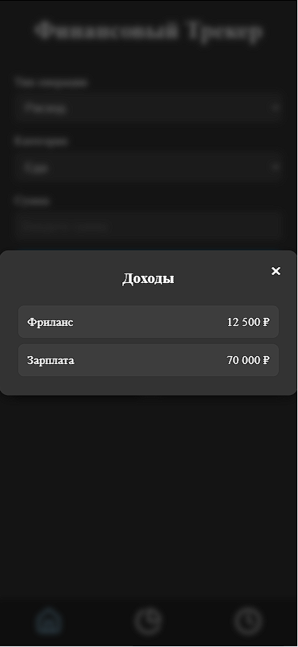

# My Finance 

Приложение создавалось для личного пользования и решенни проблемы больших расходов в пустоту. При использовании банковской карты, в приложении можно увидеть расходы и доходы, но при использовании наличных есть необходимость вести такой "дневник" финансов.

### Приложение позволяет: 
- Добавлять статьи расходов и доходов
- Выбрать категорию 
- Отслеживать историю всех операций
- Отслеживать суммы расходов и доходов по конкретным категориям 
- Визуализация в виде кругового графика

### Используемые технологии

- React
- React Router
- React Hook Form
- Redux Toolkit
- Supabse
- Local Storage
- Кастомный хук useTransaction()
- Chart.js

### Презентация проекта
[Рабочая версия](https://my-finance-delta-three.vercel.app/)

[Ссылка на GitHub](https://github.com/UstinskiyDmitriy/my-finance)

| Mobile | Desktop |
| :-: | :-: |
||  |
||  |
||  |
||  |
||  |
||  |

### Что было сделано 

- Создание всех React компонентов 
- Настройка состояния приложения в Redux Toolkit
- Настройка роутинга
- Создание кастомного хука для взаимодействия с состояниями 
- Реализовал регистрацию пользователей
- Реализовал хранение данных транзакций в БД Supabase
- Добавлена страница с накоплениями 
### Что планируется добавить/изменить

- Возможность добавление собственных категорий 
- Добавить уведомления в телеграм и возможность выключать их 
- создать бота телеграм для полуения уведомлений 

### Инструкция по запуску 

1. Склонировать репозиторий: https://github.com/UstinskiyDmitriy/my-finance.git
2. Установить зависимости: __npm install__
3. Запустить проект: __npm run dev__

